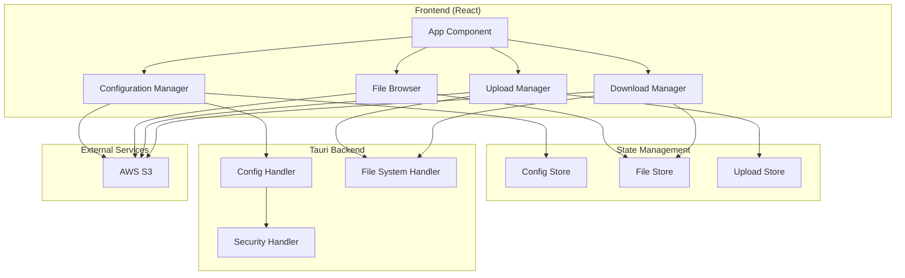

# Design Document

## Overview

S3上传工具是一个基于Tauri框架的桌面应用程序，使用React作为前端框架，Tailwind CSS进行样式设计。应用程序提供完整的S3文件管理功能，包括配置管理、文件上传下载、以及配置的导入导出。

### 技术栈
- **后端**: Tauri (Rust)
- **前端**: React 18 + TypeScript
- **样式**: Tailwind CSS
- **状态管理**: Zustand
- **S3客户端**: AWS SDK for JavaScript (v3)
- **文件系统**: Tauri File System API

## Architecture

### 整体架构



### 分层架构

1. **表现层 (Presentation Layer)**
   - React组件负责UI渲染和用户交互
   - 使用Tailwind CSS进行样式设计
   - 响应式设计支持不同屏幕尺寸

2. **业务逻辑层 (Business Logic Layer)**
   - Zustand stores管理应用状态
   - 自定义hooks处理业务逻辑
   - S3 SDK集成处理云存储操作

3. **数据访问层 (Data Access Layer)**
   - Tauri commands处理文件系统操作
   - 本地配置存储和加密
   - S3 API调用

## Components and Interfaces

### 前端组件结构

```
src/
├── components/
│   ├── common/
│   │   ├── Button.tsx
│   │   ├── Input.tsx
│   │   ├── Modal.tsx
│   │   ├── ProgressBar.tsx
│   │   ├── LoadingSpinner.tsx
│   │   ├── StatusIndicator.tsx
│   │   ├── SearchInput.tsx
│   │   └── ConfirmDialog.tsx
│   ├── config/
│   │   ├── ConfigList.tsx              # 配置列表主组件
│   │   ├── ConfigCard.tsx              # 单个配置卡片
│   │   ├── ConfigForm.tsx              # 配置表单（新建/编辑）
│   │   ├── ConfigTemplateSelector.tsx  # 配置模板选择器
│   │   ├── ConfigImportExport.tsx      # 导入导出功能
│   │   ├── ConnectionTest.tsx          # 连接测试组件
│   │   ├── ConnectionDiagnostics.tsx   # 连接诊断详情
│   │   ├── BatchOperations.tsx         # 批量操作工具栏
│   │   └── DragDropImport.tsx          # 拖拽导入区域
│   ├── files/
│   │   ├── FileBrowser.tsx
│   │   ├── FileList.tsx
│   │   ├── FileItem.tsx
│   │   └── FileContextMenu.tsx
│   ├── upload/
│   │   ├── UploadZone.tsx
│   │   ├── UploadQueue.tsx
│   │   └── UploadProgress.tsx
│   └── layout/
│       ├── Header.tsx
│       ├── Sidebar.tsx
│       └── MainContent.tsx
├── stores/
│   ├── configStore.ts
│   ├── fileStore.ts
│   └── uploadStore.ts
├── hooks/
│   ├── useS3Client.ts
│   ├── useFileOperations.ts
│   ├── useConfig.ts
│   └── useConfigTemplates.ts
├── services/
│   ├── s3Service.ts
│   ├── configService.ts
│   ├── templateService.ts
│   └── fileService.ts
└── types/
    ├── config.ts
    ├── file.ts
    ├── template.ts
    └── upload.ts
```

### 核心接口定义

#### 配置接口
```typescript
interface S3Config {
  id: string;
  name: string;
  accessKeyId: string;
  secretAccessKey: string;
  region: string;
  bucketName: string;
  endpoint?: string;
  forcePathStyle?: boolean;
  templateId?: string;
  createdAt: Date;
  updatedAt: Date;
  lastUsed?: Date;
  connectionStatus?: 'connected' | 'error' | 'testing' | 'unknown';
  connectionError?: string;
  tags?: string[];
}

interface ConfigTemplate {
  id: string;
  name: string;
  provider: 'aws' | 'minio' | 'aliyun' | 'tencent' | 'custom';
  description: string;
  icon: string;
  defaultValues: Partial<S3Config>;
  requiredFields: string[];
  regions?: { value: string; label: string }[];
}

interface ConfigStore {
  configs: S3Config[];
  activeConfigId: string | null;
  selectedConfigs: string[];
  searchQuery: string;
  sortBy: 'name' | 'lastUsed' | 'createdAt';
  sortOrder: 'asc' | 'desc';
  
  // CRUD operations
  addConfig: (config: Omit<S3Config, 'id' | 'createdAt' | 'updatedAt'>) => Promise<void>;
  updateConfig: (id: string, config: Partial<S3Config>) => Promise<void>;
  deleteConfig: (id: string) => Promise<void>;
  deleteConfigs: (ids: string[]) => Promise<void>;
  duplicateConfig: (id: string) => Promise<void>;
  
  // Selection and filtering
  setActiveConfig: (id: string) => void;
  toggleConfigSelection: (id: string) => void;
  selectAllConfigs: () => void;
  clearSelection: () => void;
  setSearchQuery: (query: string) => void;
  setSorting: (sortBy: string, sortOrder: 'asc' | 'desc') => void;
  
  // Import/Export
  exportConfigs: (configIds?: string[], includeSensitive?: boolean) => Promise<void>;
  importConfigs: (file: File | string, options?: ImportOptions) => Promise<ImportResult>;
  
  // Connection testing
  testConnection: (config: S3Config) => Promise<ConnectionTestResult>;
  testAllConnections: () => Promise<void>;
  
  // Templates
  getTemplates: () => ConfigTemplate[];
  createFromTemplate: (templateId: string) => Partial<S3Config>;
}

interface ImportOptions {
  overwriteExisting?: boolean;
  validateBeforeImport?: boolean;
  skipInvalid?: boolean;
}

interface ImportResult {
  success: boolean;
  imported: number;
  skipped: number;
  errors: string[];
  conflicts: ConfigConflict[];
}

interface ConfigConflict {
  existingConfig: S3Config;
  newConfig: Partial<S3Config>;
  conflictType: 'name' | 'duplicate';
}

interface ConnectionTestResult {
  success: boolean;
  duration: number;
  details: {
    authentication: boolean;
    bucketAccess: boolean;
    permissions: string[];
    bucketInfo?: {
      region: string;
      creationDate: Date;
      objectCount?: number;
    };
  };
  error?: {
    code: string;
    message: string;
    suggestions: string[];
  };
}
```

#### 文件接口
```typescript
interface S3File {
  key: string;
  name: string;
  size: number;
  lastModified: Date;
  etag: string;
  isDirectory: boolean;
}

interface FileStore {
  files: S3File[];
  currentPath: string;
  loading: boolean;
  error: string | null;
  loadFiles: (path?: string) => Promise<void>;
  navigateToPath: (path: string) => void;
  deleteFile: (key: string) => Promise<void>;
  downloadFile: (key: string, localPath: string) => Promise<void>;
}
```

#### 上传接口
```typescript
interface UploadTask {
  id: string;
  file: File;
  key: string;
  progress: number;
  status: 'pending' | 'uploading' | 'completed' | 'failed';
  error?: string;
}

interface UploadStore {
  tasks: UploadTask[];
  addTask: (file: File, key: string) => void;
  startUpload: (taskId: string) => Promise<void>;
  pauseUpload: (taskId: string) => void;
  removeTask: (taskId: string) => void;
  clearCompleted: () => void;
}
```

### Tauri Commands

```rust
// src-tauri/src/commands.rs
#[tauri::command]
pub async fn save_config(config: String) -> Result<(), String> {
    // 加密并保存配置到本地文件
}

#[tauri::command]
pub async fn load_config() -> Result<String, String> {
    // 从本地文件加载并解密配置
}

#[tauri::command]
pub async fn export_config(path: String, config: String) -> Result<(), String> {
    // 导出配置到指定路径
}

#[tauri::command]
pub async fn import_config(path: String) -> Result<String, String> {
    // 从指定路径导入配置
}

#[tauri::command]
pub async fn select_download_path() -> Result<String, String> {
    // 打开文件选择对话框
}
```

## Data Models

### 配置数据模型

配置数据将以加密形式存储在本地文件系统中：

```
~/.s3-upload-tool/
├── config.encrypted      # 加密的配置文件
├── cache/                # 文件缓存目录
└── logs/                 # 应用日志
```

### 状态管理模型

使用Zustand进行状态管理，采用分片存储模式：

1. **配置存储 (ConfigStore)**
   - 管理S3连接配置
   - 处理配置的增删改查
   - 管理活跃配置

2. **文件存储 (FileStore)**
   - 管理当前目录的文件列表
   - 处理文件导航和操作
   - 缓存文件元数据

3. **上传存储 (UploadStore)**
   - 管理上传任务队列
   - 跟踪上传进度
   - 处理上传错误和重试

## Error Handling

### 错误分类

1. **网络错误**
   - 连接超时
   - 网络不可达
   - DNS解析失败

2. **认证错误**
   - 无效的访问密钥
   - 权限不足
   - 令牌过期

3. **文件操作错误**
   - 文件不存在
   - 磁盘空间不足
   - 权限不足

4. **配置错误**
   - 无效的配置格式
   - 缺少必需字段
   - 配置文件损坏

### 错误处理策略

```typescript
interface ErrorHandler {
  handleS3Error: (error: S3Error) => UserFriendlyError;
  handleFileSystemError: (error: FileSystemError) => UserFriendlyError;
  handleNetworkError: (error: NetworkError) => UserFriendlyError;
  showErrorToast: (error: UserFriendlyError) => void;
  logError: (error: Error, context: string) => void;
}

interface UserFriendlyError {
  title: string;
  message: string;
  actionable: boolean;
  retryable: boolean;
  suggestions?: string[];
}
```

### 重试机制

- **指数退避重试**：网络请求失败时使用指数退避算法
- **用户手动重试**：提供重试按钮供用户手动重试
- **自动重试限制**：最多自动重试3次，避免无限重试

## Testing Strategy

### 单元测试

使用Jest和React Testing Library进行组件测试：

```typescript
// 组件测试示例
describe('ConfigForm', () => {
  test('should validate required fields', () => {
    // 测试表单验证
  });
  
  test('should save valid configuration', () => {
    // 测试配置保存
  });
});

// Hook测试示例
describe('useS3Client', () => {
  test('should create S3 client with valid config', () => {
    // 测试S3客户端创建
  });
});
```

### 集成测试

使用Tauri的测试框架进行端到端测试：

```rust
#[cfg(test)]
mod tests {
    use super::*;
    
    #[tokio::test]
    async fn test_config_save_and_load() {
        // 测试配置的保存和加载
    }
    
    #[tokio::test]
    async fn test_file_operations() {
        // 测试文件操作
    }
}
```

### 性能测试

- **文件上传性能**：测试大文件上传的性能和稳定性
- **文件列表性能**：测试大量文件列表的渲染性能
- **内存使用**：监控应用的内存使用情况

### 安全测试

- **配置加密测试**：验证配置文件的加密和解密
- **敏感数据处理**：确保敏感数据不会泄露到日志或缓存
- **输入验证测试**：测试各种输入的验证和清理

## UI/UX Design Specifications

### 配置管理页面布局

#### 主要布局结构
```
┌─────────────────────────────────────────────────────────────┐
│ Header: 配置管理 + 搜索框 + 新建配置按钮                      │
├─────────────────────────────────────────────────────────────┤
│ Toolbar: 批量操作 + 排序选项 + 视图切换 + 导入导出           │
├─────────────────────────────────────────────────────────────┤
│ ┌─────────────┐ ┌─────────────┐ ┌─────────────┐ ┌─────────┐ │
│ │ Config Card │ │ Config Card │ │ Config Card │ │   Add   │ │
│ │   [Active]  │ │  [Testing]  │ │   [Error]   │ │  Card   │ │
│ └─────────────┘ └─────────────┘ └─────────────┘ └─────────┘ │
│ ┌─────────────┐ ┌─────────────┐                             │
│ │ Config Card │ │ Config Card │                             │
│ │ [Connected] │ │ [Inactive]  │                             │
│ └─────────────┘ └─────────────┘                             │
└─────────────────────────────────────────────────────────────┘
```

#### 配置卡片设计
```typescript
interface ConfigCardProps {
  config: S3Config;
  isActive: boolean;
  isSelected: boolean;
  onSelect: (id: string) => void;
  onEdit: (id: string) => void;
  onDelete: (id: string) => void;
  onTest: (id: string) => void;
  onSetActive: (id: string) => void;
}
```

**卡片状态样式：**
- **活跃配置**: 蓝色边框 + 活跃标识
- **连接正常**: 绿色状态点 + 连接时间
- **连接错误**: 红色状态点 + 错误提示
- **测试中**: 黄色状态点 + 加载动画
- **未知状态**: 灰色状态点

#### 配置表单设计

**模板选择器**
```
┌─────────────────────────────────────────────────────────────┐
│ 选择配置模板                                                │
├─────────────────────────────────────────────────────────────┤
│ ┌─────┐ ┌─────┐ ┌─────┐ ┌─────┐ ┌─────┐                     │
│ │ AWS │ │MinIO│ │阿里云│ │腾讯云│ │自定义│                     │
│ │ 🟠  │ │ 🔵  │ │ 🟡  │ │ 🟢  │ │ ⚙️  │                     │
│ └─────┘ └─────┘ └─────┘ └─────┘ └─────┘                     │
└─────────────────────────────────────────────────────────────┘
```

**表单布局**
- 左侧：基本信息（名称、模板、标签）
- 右侧：连接参数（密钥、区域、存储桶）
- 底部：高级选项（端点、路径样式）
- 操作区：测试连接、保存、取消

#### 连接测试界面

**测试进度显示**
```
┌─────────────────────────────────────────────────────────────┐
│ 连接测试进行中...                                           │
├─────────────────────────────────────────────────────────────┤
│ ✅ 验证访问密钥                                             │
│ ✅ 检查网络连接                                             │
│ 🔄 验证存储桶权限                                           │
│ ⏳ 获取存储桶信息                                           │
└─────────────────────────────────────────────────────────────┘
```

**测试结果显示**
```
┌─────────────────────────────────────────────────────────────┐
│ ✅ 连接测试成功 (耗时: 1.2秒)                               │
├─────────────────────────────────────────────────────────────┤
│ 存储桶信息:                                                 │
│ • 名称: my-bucket                                           │
│ • 区域: us-east-1                                           │
│ • 创建时间: 2024-01-15                                      │
│ • 对象数量: 1,234                                           │
│                                                             │
│ 权限检查:                                                   │
│ • ✅ 读取权限                                               │
│ • ✅ 写入权限                                               │
│ • ❌ 删除权限 (建议检查IAM策略)                              │
└─────────────────────────────────────────────────────────────┘
```

#### 导入导出界面

**拖拽导入区域**
```
┌─────────────────────────────────────────────────────────────┐
│                    📁                                       │
│              拖拽配置文件到此处                              │
│                     或                                      │
│              [点击选择文件]                                  │
│                                                             │
│ 支持格式: .json, .yaml                                      │
│ 最大文件大小: 10MB                                          │
└─────────────────────────────────────────────────────────────┘
```

**导入预览**
```
┌─────────────────────────────────────────────────────────────┐
│ 导入预览 (发现 3 个配置)                                    │
├─────────────────────────────────────────────────────────────┤
│ ✅ AWS Production    [新建]                                 │
│ ⚠️  AWS Staging      [冲突] → 重命名为 "AWS Staging (1)"    │
│ ✅ MinIO Local       [新建]                                 │
├─────────────────────────────────────────────────────────────┤
│ 冲突处理: ○ 重命名  ○ 覆盖  ● 跳过                         │
│ [取消] [导入选中的配置]                                      │
└─────────────────────────────────────────────────────────────┘
```

### 交互设计规范

#### 状态反馈
- **加载状态**: 骨架屏 + 进度指示器
- **成功操作**: 绿色Toast通知 + 图标动画
- **错误处理**: 红色Toast + 详细错误信息 + 重试按钮
- **警告提示**: 黄色Toast + 确认对话框

#### 动画效果
- **卡片悬停**: 轻微阴影增强 + 0.2s过渡
- **状态切换**: 颜色渐变 + 图标旋转
- **列表操作**: 滑入滑出动画
- **模态框**: 淡入淡出 + 缩放效果

#### 响应式设计
- **桌面端**: 4列卡片网格布局
- **平板端**: 2列卡片网格布局  
- **手机端**: 单列列表布局 + 底部操作栏

#### 无障碍设计
- **键盘导航**: Tab键顺序 + Enter/Space操作
- **屏幕阅读器**: ARIA标签 + 语义化HTML
- **高对比度**: 支持系统主题切换
- **字体缩放**: 支持200%字体缩放

## Security Considerations

### 数据加密

- 使用AES-256加密存储敏感配置
- 密钥派生使用PBKDF2算法
- 每次启动生成新的加密盐值

### 内存安全

- 及时清理内存中的敏感数据
- 使用安全的字符串处理方法
- 避免敏感数据出现在日志中

### 网络安全

- 强制使用HTTPS连接
- 验证SSL证书
- 支持自定义CA证书

### 权限控制

- 最小权限原则
- 文件系统访问权限控制
- 网络访问权限控制